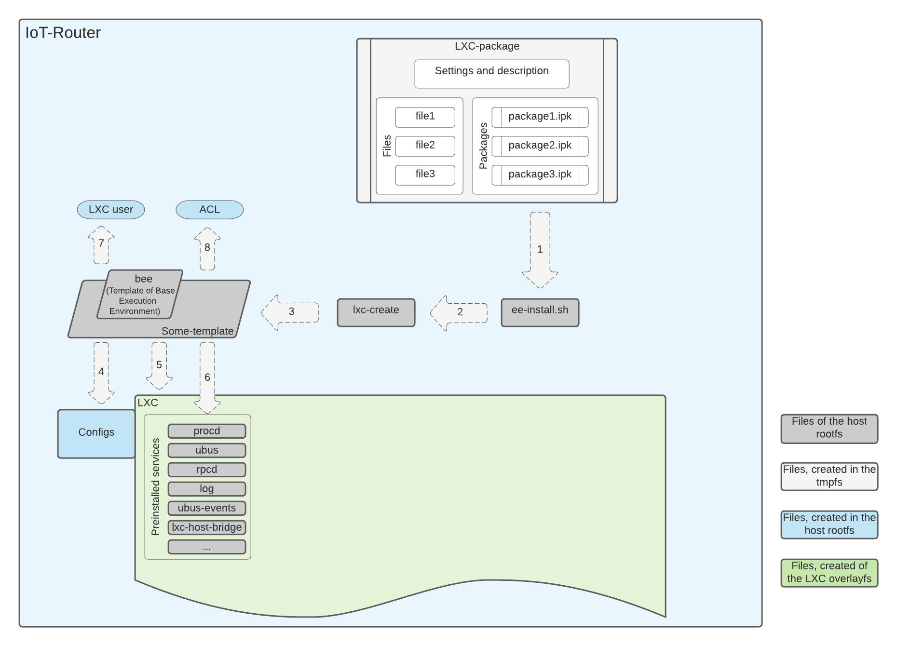
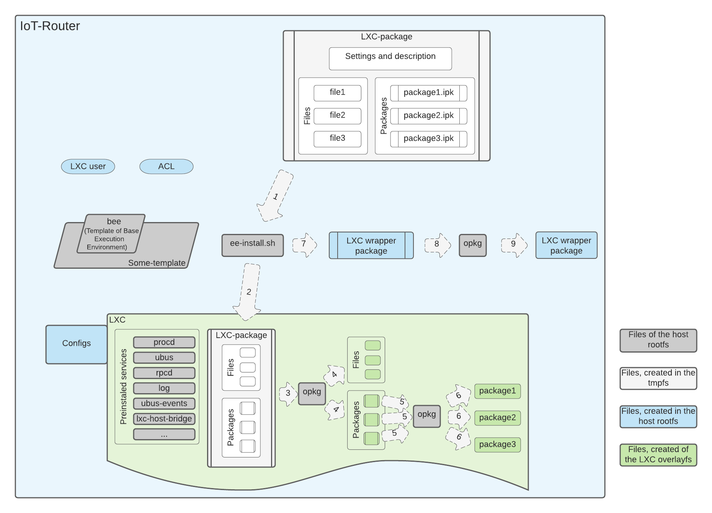
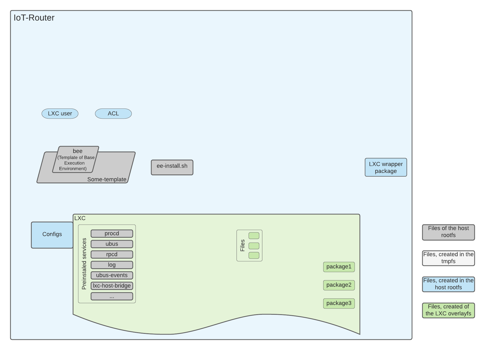
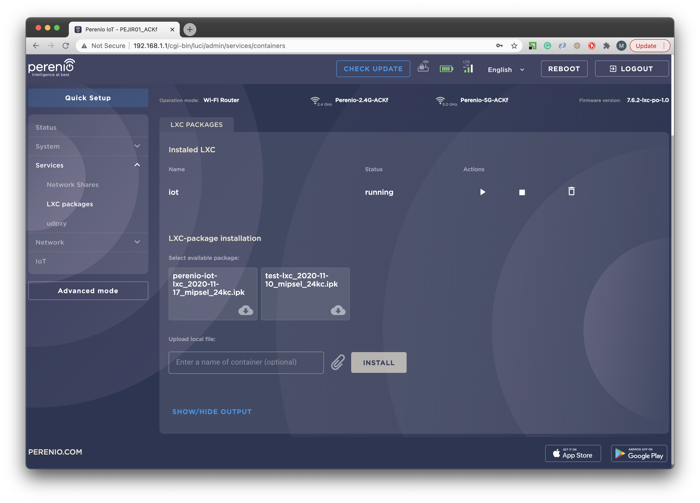
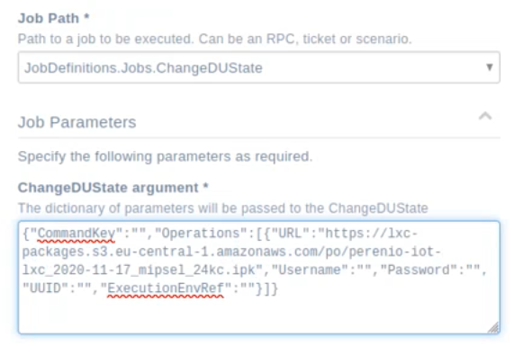

# Perenio LXC EE system. User manual

v4.2.1

<!-- TOC -->

- [Perenio LXC EE system. User manual](#perenio-lxc-ee-system-user-manual)
- [1. Introduction](#1-introduction)
    - [1.1 Purposes](#11-purposes)
- [2\. The perenio-ee package](#2\-the-perenio-ee-package)
    - [2.1. Tools](#21-tools)
        - [2.1.1. ee-install](#211-ee-install)
            - [2.1.1.1 Usage](#2111-usage)
            - [2.1.1.2 Examples](#2112-examples)
        - [2.1.2. ee-remove](#212-ee-remove)
            - [2.1.2.1 Usage](#2121-usage)
        - [2.1.3. ee-info](#213-ee-info)
            - [2.1.3.1 Usage](#2131-usage)
            - [2.1.1.2 Examples](#2112-examples-1)
    - [2.2. Perenio Execution Environments (templates)](#22-perenio-execution-environments-templates)
        - [2.2.1. BEE](#221-bee)
            - [2.2.1.1. The LXC overlay rootfs filesystem](#2211-the-lxc-overlay-rootfs-filesystem)
            - [2.2.1.2. The LXC user](#2212-the-lxc-user)
            - [2.2.1.3. Logs and the logrotate service](#2213-logs-and-the-logrotate-service)
            - [2.2.1.4. The LXC wrapper package](#2214-the-lxc-wrapper-package)
            - [2.2.1.5. LXC-package options](#2215-lxc-package-options)
        - [2.2.2. BIP-brlan-DHCP-EE](#222-bip-brlan-dhcp-ee)
        - [2.2.3. BIP-brlxc-STATIC-EE](#223-bip-brlxc-static-ee)
        - [2.2.4. IOT-EE](#224-iot-ee)
        - [2.2.5. IOT-IP-EE](#225-iot-ip-ee)
    - [2.3. LXC-package options](#23-lxc-package-options)
        - [2.3.1. HIDDEN_FILES](#231-hidden_files)
        - [2.3.2. OPAQUE_DIRS](#232-opaque_dirs)
        - [2.3.3. SSH](#233-ssh)
        - [2.3.4. SSH_KEY](#234-ssh_key)
        - [2.3.5. WEB_HTTP and WEB_HTTPS](#235-web_http-and-web_https)
        - [2.3.6. PROXY](#236-proxy)
    - [2.4. LXC-package installation process](#24-lxc-package-installation-process)
        - [2.4.1. LXC creation](#241-lxc-creation)
        - [2.4.2. LXC-package contents installation](#242-lxc-package-contents-installation)
        - [2.4.3. Final clean-up](#243-final-clean-up)
- [3\. Prepare an LXC-package](#3\-prepare-an-lxc-package)
    - [3.1. LXC-package options](#31-lxc-package-options)
    - [3.2. Files](#32-files)
    - [3.3. Packages](#33-packages)
- [4\. LXC-packages Lifecycle Management](#4\-lxc-packages-lifecycle-management)
    - [4.1. CLI management](#41-cli-management)
        - [4.1.1. Install](#411-install)
            - [4.1.1.1. ee-install](#4111-ee-install)
        - [4.1.2. Remove](#412-remove)
            - [4.1.2.1. lxc-destroy](#4121-lxc-destroy)
            - [4.1.2.2. opkg remove (for perenio-ee v2.0+)](#4122-opkg-remove-for-perenio-ee-v20)
        - [4.1.3. Start](#413-start)
            - [4.1.3.1. lxc-start](#4131-lxc-start)
        - [4.1.4. Stop](#414-stop)
            - [4.1.4.1. lxc-stop](#4141-lxc-stop)
        - [4.1.5. Update](#415-update)
    - [4.2. Web-interface management](#42-web-interface-management)
    - [4.3. TR-069 management](#43-tr-069-management)
- [Attachments](#attachments)

<!-- /TOC -->


# 1. Introduction

Perenio LXC EE (LinuX Containers Execution Environment) system is a set of tools to manage LXC's in IoT-Router.  
This document describes Perenio LXC EE v4.2.1.

## 1.1 Purposes

Purposes of the Perenio LXC EE are:

1.  To provide an application and service isolation framework based on LXC
    for OpenWRT IoT-Routers. This framework is focused to be used by
    3rd-party developers to provide their services for Perenio
    IoT-Router.
2.  To reduce space occupied by LXCs. OverlayFS provides controlled access to the host filesystem according to LXC's access rights.
3.  To provide a single interface for LXC lifecycle management.
4.  To provide a single-file form for the LXC installation pack.
5.  To provide a single-action flow for an LXC install.
6.  To provide an interface to TR-069 for LXC management.
7.  To provide built-in options to configure LXC network connection type (host IP, DHCP IP in the host LAN, static IP in the LXC area network).
8.  To provide a smooth integration of LXC's Web pages to the router's Web interface.
9.  To provide a set of service options to simplify tools integration to user's LXC (ssh, zeroconf, proxy, etc.).


# 2\. The perenio-ee package

The **perenio-ee** is an OpenWRT package for Perenio IoT-Router that contains a set of LXC EE templates and tools to install LXC-packages.

**LXC-package** is an extended version of the `.ipk` package that contains files, packages, service scripts, and configuration data to create an LXC and install all required stuff there.

LXC-package has to be installed by the [ee-install](#211-ee-install) tool only. The opkg tool can't be used for LXC-package install. This is the result of a security-based approach (to avoid run 3rd-party code or scripts on the host system).


## 2.1. Tools

  - **ee-install** - a tool to create an LXC from a template and install the LXC-package into it.
  - **ee-remove** - a tool to remove an installed LXC-package.
  - **ee-info** - a tool to display information about an installed LXC-package.

### 2.1.1. ee-install

**ee-install** is a tool to install an LXC-package as a Linux container on the host system.

#### 2.1.1.1 Usage

```shell
ee-install -h|--help|<options>

Mandatory options:
    [-p|--pkg=]<pkg.ipk>                - The path and the filename of the LXC-package to be installed.
    -n|--name=<name>                    - The name of the creating LXC.
Additional options:
    -t|--templ=<template_name>          - The name of the template used to create the LXC
    --decrypt                           - Decrypt the LXC-package by the device credentials.
                                          By default, *.ipk LXC-packages are not encrypted,
                                          *.bin LXC-packages are encrypted and should be decrypted before install.
    --hidden=<dirs/files to hide>       - Hide the specified files/dirs of the host filesystem.
                                          For example, --hidden="/etc/file_example /usr/dir_example"
    --opaque=<dirs to be opaque>        - Makes the specified dirs of the host filesystem opaque.
                                          For example, --opaque="/etc/dir_example1 /usr/dir_example2"
    -s|--ssh                            - Enable SSH access to LXC.
    --sshport=<port>                    - The port number for SSH access.
    --sshkey=<public_keyfile>           - The key-file for SSH access.
    -w|--web                            - Enable Web-Server in LXC (HTTP only. Tha same as --web_http=on).
    --web_mode=<HTTP|HTTPS|both>        - Select HTTP/HTTPS mode. "HTTP only" is default.
    --web_http=<port>                   - HTTP port number for Web-Server ("on" - using the port default value).
    --web_https=<port>                  - HTTPS port number for Web-Server ("on" - using the port default value).
    --proxy=<proxy ports>               - Ports that should be proxied to the LXC from the host.
    -e|--events=<ubus_events_pattern>   - The available UBUS-events pattern file.
    --no_autostart                      - Disable LXC autostart at system startup.

```

#### 2.1.1.2 Examples

* Setup the perenio-iot-lxc LXC-package
    ```shell
    ee-install perenio-iot-lxc_2020-11-17_mipsel_24kc.ipk
    ```
* Setup the encrypted perenio-iot-lxc LXC-package
    ```shell
    ee-install perenio-iot-lxc_2020-11-17_mipsel_24kc.bin
    ```
* Setup the perenio-iot-lxc LXC-package named Smart-home
    ```shell
    ee-install -n Smart-home -p perenio-iot-lxc_2020-11-17_mipsel_24kc.ipk
    ```
* Setup an empty bip-brlxc-static-ee template
    ```shell
    ee-install -t bip-brlxc-static-ee -n empty_iot
    ```

### 2.1.2. ee-remove

**ee-remove** is a tool to install an LXC-package as a Linux container on the host system.  
The same result as the original `lxc-destroy` command. However `ee-remove` can use an LXC-package file name instead of an LXC name.

#### 2.1.2.1 Usage

```shell
ee-remove -h|--help | [ [-n|--name=]<name>] [-p|--pkg=<pkg.ipk>]

```
Where:  
    `name` is the LXC name.
    `pkg.ipk` is the LXC-package file name.

### 2.1.3. ee-info

**ee-info** a tool to display information about an installed LXC-package.

#### 2.1.3.1 Usage

```shell
ee-info -h|--help | -l|--list | [ [-n|--name=]<name>] [-p|--pkg=<pkg.ipk>]

```
Where:
    `--list` is an option to display a list of installed LXC-packages.
    `name` is the LXC name.
    `pkg.ipk` is the LXC-package file name.

#### 2.1.1.2 Examples

```shell
root@PEJIR01_ACKf:~# ee-info iot
LXC info:
    Name:           iot
    State:          RUNNING
    PID:            20643
    IP:             192.168.192.2
    CPU use:        31.32 seconds
    Memory use:     10.73 MiB
    KMem use:       2.51 MiB
    Link:           vethD7AUKP
     TX bytes:      11.07 KiB
     RX bytes:      10.46 KiB
     Total bytes:   21.53 KiB
LXC-package config:
    lxcpkg.iot=iot-ip-ee
    lxcpkg.iot.lxcpkg='perenio-lxc-iot_2021-05-31_mipsel_24kc.ipk'
    lxcpkg.iot.AUTOSTART='1'
    lxcpkg.iot.ip='192.168.192.2'
    lxcpkg.iot.hostpkg='perenio-lxc-iot.iot'
Host-package config:
    Package: perenio-lxc-iot.iot
    Version: 2021-05-31
    Status: install user installed
    Architecture: mipsel_24kc
    Installed-Time: 1624433478

```        

## 2.2. Perenio Execution Environments (templates)

  - [bee](#221-bee) - Base Execution Environment (BEE). Define an allocation of a minimal set of resources. Can be used for a simple LXC.
  - [bip-brlan-dhcp-ee](#222-bip-brlan-dhcp-ee) - Base Execution Environment that has it's own IP-address obtained by DHCP from br-lan. Based on BEE.
  - [bip-brlxc-static-ee](#223-bip-brlxc-static-ee) - Base Execution Environment that has it's own static IP-address in br-lxc. Based on BEE.
  - [iot-ee](#224-iot-ee) - IoT Execution Environment (IOT-EE). Define an allocation of a set of resources that required for IoT applications. Based on BEE. It provides access to ZigBee and Z-Wave(optional) ports.
  - [iot-ip-ee](#225-iot-ip-ee) - IoT Execution Environment that is based on bip-brlxc-static-ee.

### 2.2.1. BEE

Perenio Base Execution Environment.

The BEE template is a root of any other Perenio LXC EE templates. It configures and implements base LXC features, like:

  - The overlay rootfs filesystem.
  - The tmpfs (`/tmp`) filesystem.
  - The LXC user for ACL-based access.
  - The root process (`procd`).
  - The `ubus` service.
  - The `rpcd` service.
  - The `log` service.
  - The `logrotate` service.
  - The `cron` service.
  - The `avahi` service (zeroconf).
  - The LXC wrapper package for the host opkg.
  - LXC-package options: OPAQUE_DIRS, HIDDEN_FILES, SSH, SSH_KEY, WEB_HTTP, WEB_HTTPS.

Other EE templates inherit all BEE features.

#### 2.2.1.1. The LXC overlay rootfs filesystem

Perenio LXC EE uses the [overlay](https://en.wikipedia.org/wiki/OverlayFS) rootfs filesystem over the host rootfs. It provides selective access to files in the host filesystem from an LXC. This avoids duplicate files that used on the host and on LXCs. All LXCs can access to the set of permitted original files on the host filesystem. At the same time, it's impossible to change or delete original host files from inside the LXC.  
A set of accessible host filesystem files can be defined individually
for every LXC template.

#### 2.2.1.2. The LXC user

An LXC user is required for ACL-based access to host features from the LCX. Each template specifies its own set of permitted features. 

#### 2.2.1.3. Logs and the logrotate service

Logs are stored in the `/logs/` directory.  
The logrotate service is configured to compress the log when it is larger than 500 kB. The maximum number of compressed logs is 10.  
Log messages from the syslogd's circular buffer can be displayed by the `logread` command or `l` command.  
Log messages from the files in `/logs/` directory can be displayed by the `l -x` command.

#### 2.2.1.4. The LXC wrapper package

This is a special opkg package for the host. It is created and installed during the installation process of an LXC-package based on BEE. It is required to remove LXC-package by the `opkg remove` command.  
The LXC wrapper package includes:
1.  LXC-package description information. It is placed in the
    `/etc/lxc-packages/` directory.
2.  Information that needs to remove LXC-package by `opkg remove`
    command

#### 2.2.1.5. LXC-package options

Available LXC-package options: OPAQUE_DIRS, HIDDEN_FILES, SSH, SSH_KEY, WEB_HTTP, WEB_HTTPS. Detailed description is available [below](#23-lxc-package-options).  
The default SSH port is 10022. Step to find the first available port is 1000.  
The default HTTP port is 10080. Step to find the first available port is 1000.  
The default HTTPS port is 10443. Step to find the first available port is 1000.

### 2.2.2. BIP-brlan-DHCP-EE

Base Execution Environment that has it's own IP-address obtained by DHCP from br-lan. It provides an LXC that has a virtual network interface connected to br-lan bridge and get its IP by DHCP. It has IP from the LAN.  
DNS access by the name of LXC is available. It provides network access to the LXC created based on this EE by the name of LXC.  
This execution environment is based on BEE.  
Additional available LXC-package option is PROXY. It provides HTTP-proxy to redirect HTTP/REST requests of the specified port from the router to the LXC.  
The default SSH port is 22. The default HTTP port is 80. The default HTTPS port is 443. Unlike BEE, there is no ports availability check.

### 2.2.3. BIP-brlxc-STATIC-EE

Base Execution Environment that has it's own static IP-address in br-lxc. It provides an LXC that has a virtual network interface connected to br-lxc bridge and gets static IP. It has IP from the LXC network that is based on dedicated br-lxc bridge. By default this network has address 192.168.192.0/24. Routing to/from WAN and LAN is provided by.   
Static address is automatically allocated and assigned to the LXC at the time of LXC creation.  
DNS access by the name of LXC is available. It provides network access to the LXC created based on this EE by the name of LXC.  
This execution environment is based on BEE.  
An additional option - PROXY - is available for LXC-packages based on this execution environment. It provides HTTP-proxy to redirect HTTP/REST requests of the specified port from the router to the LXC.  
The default SSH port is 22. The default HTTP port is 80. The default HTTPS port is 443. Unlike BEE, there is no ports availability check.

### 2.2.4. IOT-EE

Perenio IoT Execution Environment. It is based on BEE. UART ports for ZigBee and Z-Wave as well as Z/IP Gateway support are added. 

### 2.2.5. IOT-IP-EE

Perenio IoT Execution Environment based on bip-brlxc-static-ee. This execution environment is an analogue of IOT-EE but it provides dedicated IP address for inherited LXCs.

## 2.3. LXC-package options

Perenio-EE provides a set of built-in features for LXC, such as SSH access, WEB-server, etc. These features can be enabled by Makefile settings or by command-line options.  
To enable a feature for every LXC-package install a developer should use Makefile settings. To apply it the developer should create config-file, set a proper setting there and mention this file by the Makefile LXC_config variable.  
To enable a feature for one time install a developer should mention required feature as a command-line option during LXC-package install. [A list of command-line options](#211-ee-install) is available by `ee-install --help`.

### 2.3.1. HIDDEN_FILES

Description: Makes the specified dirs or files of the host filesystem hidden for the LXC. Can be used to avoid overwrite warnings/errors during package install in the LXC. Such warnings/errors may appear when host files/dirs that are visible through OverlayFS.  
Templates: All  
Command-line usage:  
```
--hidden="/etc/file_example /usr/dir_example"
```
Makefile usage:
```makefile
HIDDEN_FILES=/etc/file_example /usr/dir_example
```

### 2.3.2. OPAQUE_DIRS

Description: Makes the specified dirs of the host filesystem opaque for the LXC. Can be used to avoid overwrite warnings/errors during package install in the LXC. Such warnings/errors may appear when host files/dirs that are visible through OverlayFS.  
Templates: All  
Command-line usage:  
```
--opaque="/etc/dir_example1 /usr/dir_example2"
```
Makefile usage:
```makefile
OPAQUE_DIRS=/etc/dir_example1 /usr/dir_example2
```


### 2.3.3. SSH

Description: Enables SSH support. Sets port number.  
Values:  
* integer number - enable SSH on the specified port number.
* `on` - enable SSH on the default port. The default port number depends on the selected template.  
      For templates that use the host IP-address, default port is the first available port starting from 10022, step 1000 (i.e. 10022, 11022, 12022, 13022, etc.).  
      For templates that have its own IP-address, default port is 22.  

Templates: All  
Command-line usage:  
```
-s
--ssh
--sshport=<port_number>
```
Makefile usage:
```makefile
SSH=on
SSH=<port_number>
```
For example: `--sshport=2222`, `SSH=2222`

### 2.3.4. SSH_KEY

Description: Enables SSH support. Specifies the key-file for SSH access. The key-file should be placed in the LXC-package filesystem.
Templates: All  
Command-line usage:  
```
--sshkey=<public_keyfile>
```
Makefile usage:
```makefile
SSH_KEY=<public_keyfile>
```
For example: `--sshkey=/etc/ssh_key`, `SSH_KEY=/etc/ssh_key`

### 2.3.5. WEB_HTTP and WEB_HTTPS

Description: Enables Web-server support. Sets port number. For templates that have its own IP-address, additional proxy called WEB_HTTP_PROXY/WEB_HTTPS_PROXY is created. It is used for integration the LXC Web-server to the host Web-interface. It can also be used for external access to the LXC Web-server by the host IP-address.  
Values:  
* integer number - enable Web-server on the specified port number.  
* `on` - enable Web-server on the default port. The default port number depends on the selected template.  
    - For HTTP:  
      For templates that use the host IP-address, default port is the first available port starting from 10080, step 1000 (i.e. 10080, 11080, 12080, 13080, etc.).  
      For templates that have its own IP-address, default port is 80.   
    - For HTTPS:  
      For templates that use the host IP-address, default port is the first available port starting from 10443, step 1000 (i.e. 10443, 11443, 12443, 13443, etc.).  
      For templates that have its own IP-address, default port is 443.   

Templates: All  
Command-line usage:  
```
-w
--web
--web_http=<port_number>
--web_https=<port_number>
```
Makefile usage:
```makefile
WEB_HTTP=on
WEB_HTTP=<port_number>
WEB_HTTPS=on
WEB_HTTPS=<port_number>
```

For example: `--web_http=8080`, `--web_https=8443`, `WEB_HTTP=8080`, `WEB_HTTPS=8443`

### 2.3.6. PROXY

Description: Enables HTTP-proxy support. Sets port number that should be proxied to the LXC. It's possible to specify several ports. Space char should be used as a delimiter.  
Values:  integer number or integer numbers.  
Templates: bip-brlan-dhcp-ee, bip-brlxc-static-ee, iot-ee, iot-ip-ee  
Command-line usage:  
```
--proxy=<proxy_ports>
```
Makefile usage:
```makefile
PROXY=<proxy_ports>
```

For example: `--proxy=8080`, `--proxy='8080 9090'`, `PROXY=8080`, `PROXY=8080 9090`

## 2.4. LXC-package installation process

### 2.4.1. LXC creation



### 2.4.2. LXC-package contents installation



### 2.4.3. Final clean-up




# 3\. Prepare an LXC-package

An LXC-package is an extension of a regular OpenWRT package. That's why it supports all features of OpenWRT packages.  
The detailed description of the LXC-package creation is available [here](Creating_LXC-package_for_IoT-Router.md) .  
The most useful options are described below.

## 3.1. LXC-package options

Perenio-EE provides for LXC set of built-in features such as SSH access, WEB-server, etc. ([LXC-package options](#23-lxc-package-options))
LXC-package options should be specified in a config file. This config file should be specified by the LXC_CONFIG variable.

```makefile
LXC_CONFIG=lxc-package.config
```


## 3.2. Files

An LXC-package can contain any files. Just copy them to the LXC-package filesystem in the Makefile.   
For example,
```makefile
 define Package/$(PKG_NAME)/install  
     $(INSTALL_DIR) $(1)/etc  
     $(CP) files/etc/* $(1)/etc/  
     ...  
 endif
```

## 3.3. Packages

An LXC-package can contain a set of packages that should be installed in the LXC. Variable LXC_PREINSTALLED_PACKAGES should be used to specify packages that should be automatically installed into the LXC-package. This variable should be used out of any section. Wildcard prefixes should be specified.  
For example,
```makefile
LXC_PREINSTALLED_PACKAGES:=perl_ perlbase-
```
This specifies to install all packages that fit wildcards `perl_*` and `perlbase-`.

# 4\. LXC-packages Lifecycle Management

The following actions are available for LXC-packages:

1.  Install
2.  Remove
3.  Start
4.  Stop
5.  Update

These actions can be done by:

1.  Command-line
2.  Web-interface
3.  TR-069

## 4.1. CLI management

### 4.1.1. Install

#### 4.1.1.1. ee-install

ee-install is an LXC-package management tool from the Perenio-EE package. It creates LXC and installs a specified LXC-package there. 

[Usage](#24-ee-install)

### 4.1.2. Remove

> Note: LXC should be stopped before remove (see
[here](#414-stop) for details)

#### 4.1.2.1. lxc-destroy

lxc-destroy is one of the LXC management tools. It removes a specified LXC from the host. According to the BEE template, all created staff (LXC user, LXC wrapper, etc.) is also removed from the host. 

    Usage: lxc-destroy -n NAME
    Options:
        -n, --name=NAME - the name of the container to destroy

#### 4.1.2.2. opkg remove (for perenio-ee v2.0+)

opkg is an OpenWRT package management tool. It removes a specified package from the host. According to the BEE template, all created staff (LXC, LXC user, etc.) is also removed from the host. 

    usage: opkg remove <pkg>
    Remove an LXC-package
        <pkg> - the LXC-package name.
    *NOTE: The LXC-package name is not the LXC-package file name. It is the package name. It can be found by the `uci show lxcpkg.<LXC name>.hostpkg` command.

### 4.1.3. Start

#### 4.1.3.1. lxc-start

lxc-start is one of LXC management tools. It starts a specified LXC.

    Usage: lxc-start -n NAME
    Options:
        -n, --name=NAME - the name of the container to start.

### 4.1.4. Stop

#### 4.1.4.1. lxc-stop

lxc-stop is one of the LXC management tools. It stops a specified LXC.

    Usage: lxc-stop -n NAME
    Options:
        -n, --name=NAME   NAME of the container to stop

### 4.1.5. Update

lxc-attach is one of the LXC management tools. It runs a specified command in a specified LXC.

    lxc-attach -n <name> -- opkg update <LXCpackage>

## 4.2. Web-interface management

All required actions (install, remove, start, stop) can be done by the web interface. The `Service`→`LXC packages` menu should be used:



## 4.3. TR-069 management

All required actions (install, remove, start, stop) can be done remotely by the ACS using TR-069. The ChangeDUState path should be used. For example:




# Attachments

 [Screenshot 2021-01-22 at
11.47.09.png](attachments/429293760/435487607.png) (image/png)  
 [Screenshot 2021-01-22 at
11.52.21.png](attachments/429293760/435487610.png) (image/png)  
 [Page 1.png](attachments/429293760/438698013.png) (image/png)  
 [Page 2.png](attachments/429293760/438698015.png) (image/png)  
 [Page 3.png](attachments/429293760/438698014.png) (image/png)  
